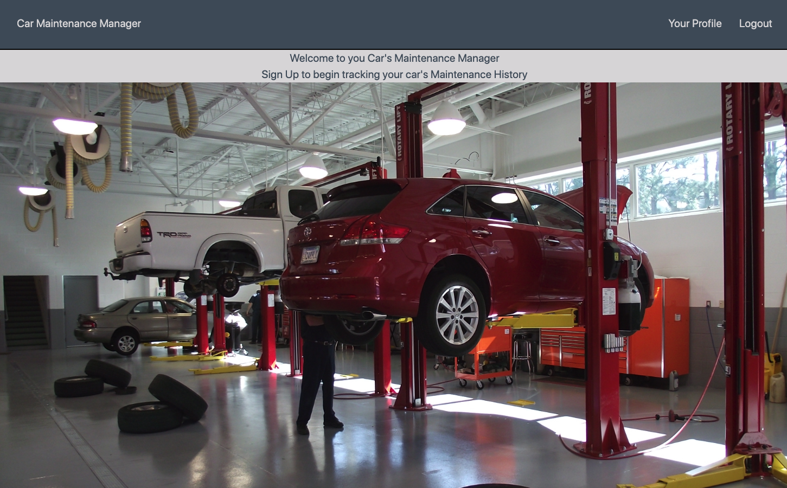
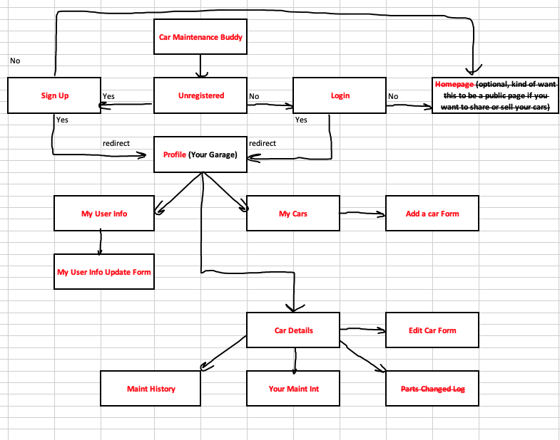
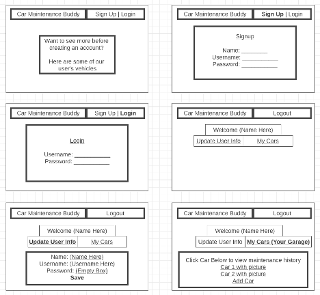
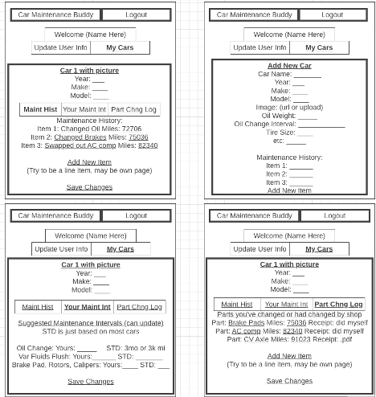
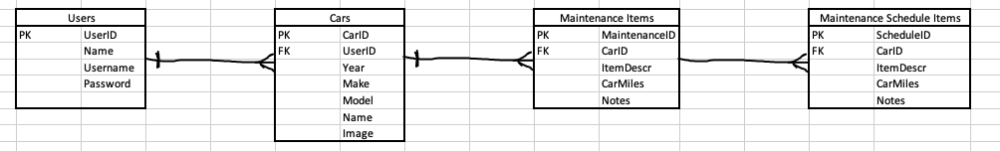

# Car Maintenance Buddy
1. Title: Car Maintenance Buddy

2. Description:
    1. Here is a link to the deployed app [Car-Maintenance-Manager](http://car-maintenance-app.surge.sh). This project is designed to be an aid for those who try to keep track of work they do on their car, have a shop do on their car, and anywhere in between. This can be as simple as keep track of your oil changes to being a one stop shop of maintenance logs (personal work and shop work) and part changes. The main idea here is to try to make life easier when doing regular maintenance on your car and also to be cognizant of parts a shop may have changed for you and actually realizing if the same parts go bad early. Alot of cars nowadays have trackers for oil and even tires and brakes, but this app can be for those who'd like a way to track it themselves especially as they are performing the maintenance themselves. This stems mainly from doing regular maintenance on my car and my family's cars with my dad and seeing how everything he does is tracked with a small notebook.

3. User Stories: 
    1. As an unregistered user, I want to be able to sign up with a username and password so that I can start tracking my car's maintenance history.
    1. As an unregistered/registered user, I would like some sort of notification if a username is taken or I input my credentials in incorrectly.
    1. As a registered user, I want to be directed straight to my profile and be allowed to update my personal info at any time in case I spelled something incorrectly.
    1. As a registered user, I want to make sure my profile is private and people cant navigate to it if they know my unique URL.
    1. As a registered user, I want to be able to add every car in my garage so I can stop getting confused on when the last time oil was changed in each car.
    1. As a car owner, I want to be able to add maintenance items for my car and the mileage they happened at so I know when they need to be done next.
    1. As a car owner, I want to be able to see suggested maintenance intervals based on standard cars.
    1. As a car owner, I would like the ability to update maintenance intervals based on what I find in my owner's manual or if I use non-dealer products such as synthetic oil that is rated to higher mileage.
    1. As a registered user, I would like some sort of way to avoid accidentally deleting something completely.

4. List of Features - MVP
    1. Signup / Login Functionality ✔
    1. Token Utilization - Useful to avoid guessing the index of a user's profile URL and modifying their profile contents ✔
    1. Add/Edit/Delete cars to and from "Your Garage" (Profile) ✔
    1. Add/Edit user personal information ✔
    1. Add/Edit/Delete maintenance items on one of your cars ✔
    1. Add/Edit/Delete maintenance schedules on one of your cars ✔
    1. Display page of typical maintenance ✔
    1. Style with TailwindCSS ✔

5. List of Features - Post MVP
    1. Allow users to either export maintenance history or parts log as a pdf and send email it to themselves ✔
    1. Turn the typical maintenance intervals into something smarter that uses an api (maybe EdmundsAPI) to tailor the suggestions to your specific year, make, model
    1. Whether or not the second works, would be interesting to add a list of tips that cycles on the homepage letting you know that if you changed your oil at 20k in April that your next oil change would normally be due at 23k miles or in July.
    1. Super stretch goal would be to implement this as more than just a personal app and allow users to post a car "for sale" on the homepage and unregistered users can view the history of what was replaced on the car. Could give car buyers some comfort knowing how well their car was maintained.

6. Unsolved Problems:
    1. Didnt properly deal with updating each component that utilized various information that was being editted and took the easy way out of refreshing the page since the backend has it all stored.
    1. User can export to a pdf but cant directly email themselves. They need to save it locally then send themselves an email if they wish to do that.
    1. Error handling wasnt done on adding a car with a non integer "year" field or on any fields that are required.

7. List of Technologies Used: 
    1. Command Line: Used to navigate file system and organize file structure.
    1. Google Chrome Developer Tools: Used to debug issues in Javascript and also used to see what HTML elements to target when trying to style with CSS.
    1. Visual Studio Code: Used for coding in HTML, CSS, and Javascript.
    1. Wireframe.cc: Used to plan the HTML and CSS portions of the project.
    1. Node.js: Backe-end JS runtime environment.
    1. Postgres: Database used to store data for our User model and Players Model.
    1. Express: Backend Framework used during development.
    1. React: Frontend Library used during development.
    1. TailwindCSS: CSS styling tech used to style entire app

8. Future Next Steps:
    1. First would be to add a parts log model to allow the user to track which parts have been changed out on their car.
    1. Would love to add a way to upload receipts to each item, would just add a column to allow them to upload these to the backend.
    1. Start jumping into post mvp items that weren't checked off.

9. Example of Home Page of Website:

10. Website Flowchart:

11. Wireframe:

12. ERD:

